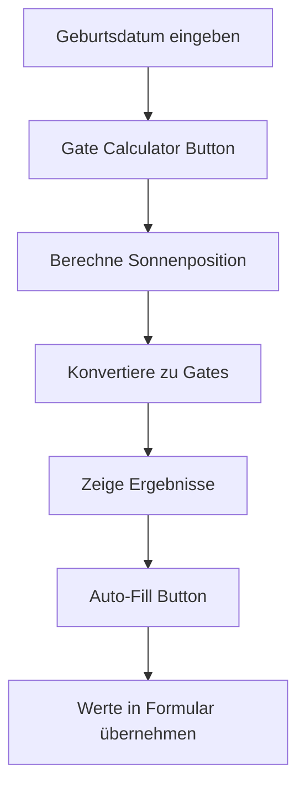

# Gate Calculator Integration - Anleitung

## 🎯 Übersicht

Der **Gate Calculator** ist jetzt vollständig in den Reading Creator integriert! Coaches können automatisch Human Design Tore aus Geburtsdaten berechnen lassen.

---

## 🚀 Features

### 1. **Automatische Gate-Berechnung**
- ✅ Berechnet Personality Sun, Earth, Design Sun & Earth
- ✅ Zeigt Tor-Nummer und Linie (z.B. "33.2")
- ✅ Deutsche Tor-Namen
- ✅ Sternzeichen-Position

### 2. **One-Click Auto-Fill**
- ✅ Übernimmt berechnete Werte in die Eingabefelder
- ✅ Spart Zeit beim Erstellen von Readings

### 3. **Live-Anzeige**
- ✅ Visuelle Darstellung in der Seitenleiste
- ✅ Farbcodierte Personality/Design-Unterscheidung

---

## 📖 Verwendung

### Schritt 1: Geburtsdatum eingeben

```
1. Öffne den Reading Creator: /coach/readings/create
2. Tab "Persönliches" auswählen
3. Geburtsdatum eingeben (z.B. 1990-05-15)
```

### Schritt 2: Gates berechnen

```
4. In der rechten Seitenleiste: "Gate Calculator"
5. Button "Tore berechnen" klicken
6. Berechnete Gates werden angezeigt:
   ☉ Bewusste Sonne (Personality)
   🌍 Bewusste Erde (Personality)
   ☉ Unbewusste Sonne (Design)
   🌍 Unbewusste Erde (Design)
```

### Schritt 3: Werte übernehmen

```
7. Button "Werte übernehmen" klicken
8. Die Gates werden automatisch in Tab "Human Design" eingefügt
9. Fertig! ✅
```

---

## 🔍 Beispiel-Berechnung

**Eingabe:**
- Geburtsdatum: `15. Mai 1990`

**Ausgabe:**
```
☉ Bewusste Sonne: Tor 33.2
   "Der Rückzug"
   Position: Löwe 7.5°

🌍 Bewusste Erde: Tor 19.6
   "Die Annäherung"

☉ Unbewusste Sonne: Tor 62.1
   "Des Kleinen Übermaß"
   Position: Steinbock 15.3°

🌍 Unbewusste Erde: Tor 61.4
   "Die innere Wahrheit"
```

---

## ⚠️ Wichtige Hinweise

### Genauigkeit

Die aktuelle Implementation verwendet eine **vereinfachte Ephemeris-Berechnung**:

- **Genauigkeit:** ±2-3 Grad für die Sonne
- **Geeignet für:** Demonstrationszwecke, Prototyping
- **NICHT geeignet für:** Professionelle Readings ohne Verifikation

### Für Produktionsumgebung

Für präzise Professional Readings solltest du eine echte Ephemeris-Bibliothek integrieren:

#### Option 1: Swiss Ephemeris (Empfohlen)

```bash
npm install swisseph
```

```typescript
import swisseph from 'swisseph';

// Ephemeris-Dateien laden
swisseph.swe_set_ephe_path('/path/to/ephemeris/files');

// Julianisches Datum berechnen
const julianDay = swisseph.swe_julday(
  year, month, day, 
  hour + minute / 60
);

// Sonnenposition berechnen
const result = swisseph.swe_calc_ut(
  julianDay, 
  swisseph.SE_SUN, 
  swisseph.SEFLG_SWIEPH
);

const sunLongitude = result.longitude;
```

#### Option 2: Astronomy Engine

```bash
npm install astronomy-engine
```

```typescript
import { SunPosition } from 'astronomy-engine';

const birthDate = new Date('1990-05-15T14:30:00Z');
const position = SunPosition(birthDate);
const longitude = position.elon; // Ecliptic longitude
```

---

## 🛠️ Technische Details

### Dateien

```
frontend/
├── lib/
│   └── human-design/
│       ├── gate-calculator.ts         # Gate-Mapping (64 Tore)
│       ├── simplified-ephemeris.ts    # Vereinfachte Berechnung
│       └── index.ts                   # Exports
├── app/
│   └── coach/
│       └── readings/
│           └── create/
│               └── page.tsx           # Reading Creator mit Integration
```

### Verwendete Funktionen

#### Gate-Berechnung

```typescript
import { getGateAndLine, getGateName } from '@/lib/human-design';

const sunLongitude = 127.5; // Grad (0-360)
const gate = getGateAndLine(sunLongitude);
// → { gate: 33, line: 2 }

const name = getGateName(33);
// → "Tor 33: Der Rückzug"
```

#### Sonnenposition (vereinfacht)

```typescript
import { calculateApproximateSunPosition } from '@/lib/human-design/simplified-ephemeris';

const birthDate = new Date('1990-05-15');
const sunLon = calculateApproximateSunPosition(birthDate);
// → 54.2° (Stier 24.2°)
```

#### Design-Berechnung

```typescript
import { calculateDesignSun } from '@/lib/human-design/simplified-ephemeris';

const personalitySun = 127.5;
const designSun = calculateDesignSun(personalitySun);
// → 39.5° (88° vorher)
```

---

## 🎨 UI-Komponenten

### Gate Calculator Card

```tsx
<Card sx={{ background: 'linear-gradient(135deg, #667eea 0%, #764ba2 100%)' }}>
  <CardContent>
    <Calculator icon /> Gate Calculator
    <Button onClick={calculateGates}>Tore berechnen</Button>
    {calculatedGates && (
      <Box>
        {/* Anzeige der berechneten Gates */}
        <Button onClick={autoFillCalculatedGates}>
          Werte übernehmen
        </Button>
      </Box>
    )}
  </CardContent>
</Card>
```

### State Management

```typescript
const [calculatedGates, setCalculatedGates] = useState<CalculatedGates | null>(null);

interface CalculatedGates {
  personalitySun: { gate: number; line: number; formatted: string; name: string } | null;
  personalityEarth: { gate: number; line: number; formatted: string; name: string } | null;
  designSun: { gate: number; line: number; formatted: string; name: string } | null;
  designEarth: { gate: number; line: number; formatted: string; name: string } | null;
  zodiacInfo: { personalitySun: string; designSun: string };
}
```

---

## 🔄 Workflow



---

## 📊 Berechnungsformel

### Vereinfachte Sonnenposition

```
DayOfYear = (BirthDate - Jan 1st) in days
SpringEquinox = Day 79 (≈ March 20)
DegreesPerDay = 360° / 365.25 ≈ 0.9856°
SunLongitude = (DayOfYear - SpringEquinox) × DegreesPerDay
```

**Beispiel:**
- Geburt: 15. Mai (Tag 135)
- Tage seit Frühlingsäquinoktium: 135 - 79 = 56
- Sonnenposition: 56 × 0.9856° ≈ 55.2° (Stier 25.2°)

### Gate-Bestimmung

Jedes Gate hat:
- **Span:** ~5.625° (5° 37′ 30″)
- **6 Linien:** je ~0.9375° (56′ 15″)

```
Gate = FindGateByLongitude(SunLongitude)
Line = Floor((Position within Gate) / LineSpan) + 1
```

---

## 🧪 Test-Beispiele

### Test 1: Sommer-Geburt

```typescript
const birthDate = new Date('1990-07-21');
calculateGates();
// Erwartete Sonne: Löwe 28° → Tor 4.x
```

### Test 2: Winter-Geburt

```typescript
const birthDate = new Date('1990-12-25');
calculateGates();
// Erwartete Sonne: Steinbock 3° → Tor 58.x
```

### Test 3: Wrap-Around (Fische/Widder)

```typescript
const birthDate = new Date('1990-03-20');
calculateGates();
// Erwartete Sonne: Widder 0° → Tor 25.x
```

---

## 🔮 Zukünftige Erweiterungen

### Phase 1: Vollständige Ephemeris ✅ (Aktuell: Vereinfacht)

- [ ] Swiss Ephemeris Integration
- [ ] Alle 13 Planeten/Punkte
- [ ] Geburtszeit-Berücksichtigung
- [ ] Geburtsort (Zeitzone/Koordinaten)

### Phase 2: Erweiterte Berechnungen

- [ ] Mondposition
- [ ] Merkur, Venus, Mars
- [ ] Jupiter, Saturn
- [ ] Uranus, Neptun, Pluto
- [ ] Mondknoten (Nord/Süd)
- [ ] Chiron

### Phase 3: Typ & Autorität

- [ ] Automatische Typ-Erkennung
- [ ] Autorität-Berechnung
- [ ] Profil-Bestimmung
- [ ] Inkarnationskreuz

### Phase 4: Visualisierung

- [ ] Bodygraph-Darstellung
- [ ] Aktivierte Zentren anzeigen
- [ ] Kanäle visualisieren
- [ ] Interaktives Chart

---

## 🐛 Bekannte Limitierungen

1. **Keine Geburtszeit-Berücksichtigung**
   - Aktuell nur Geburtsdatum
   - Aszendent/Mondposition nicht präzise

2. **Vereinfachte Planetenpositionen**
   - Nur Sonne/Erde berechnet
   - Andere Planeten nicht verfügbar

3. **Keine Präzession**
   - Tropischer Tierkreis verwendet
   - Siderischer Tierkreis nicht unterstützt

4. **Keine Retrogradenbewegung**
   - Planeten immer vorwärts
   - Rückläufigkeit nicht berücksichtigt

---

## 📞 Support

### Bei Fragen:
- **Dokumentation:** `HD-GATE-CALCULATOR-ANLEITUNG.md`
- **Code:** `frontend/lib/human-design/`
- **Integration:** `frontend/app/coach/readings/create/page.tsx`

### Bei Problemen:
1. Prüfe Browser-Console auf Fehler
2. Stelle sicher, dass Geburtsdatum eingegeben ist
3. Prüfe Format: `YYYY-MM-DD`

---

## 🎓 Lernressourcen

- **Human Design System:** [Official Website](https://www.humandesignsystem.com/)
- **Gate-Positionen:** [Barney + flo(w)](https://www.barneyandflow.com/gate-zodiac-degrees)
- **Rave Mandala:** [Jovian Archive](https://www.jovianarchive.com/)
- **Swiss Ephemeris:** [Documentation](https://www.astro.com/swisseph/)

---

**Version:** 1.0.0  
**Erstellt:** 2025-10-18  
**Status:** ✅ Funktional (Simplified Ephemeris)  
**Nächster Schritt:** Swiss Ephemeris Integration für Produktion

